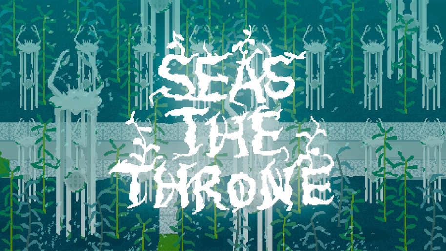
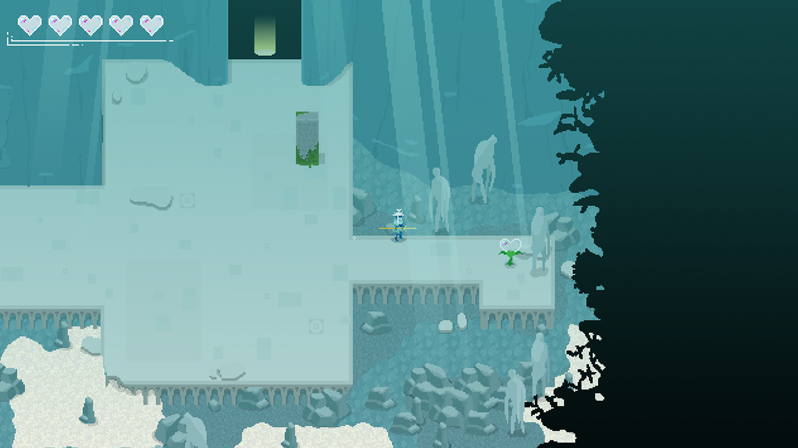
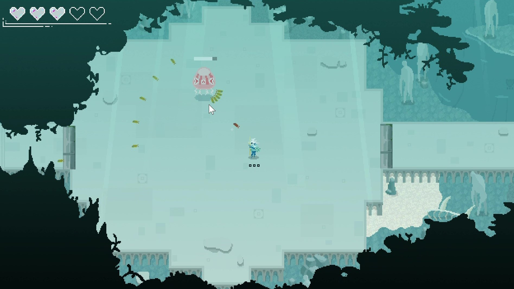
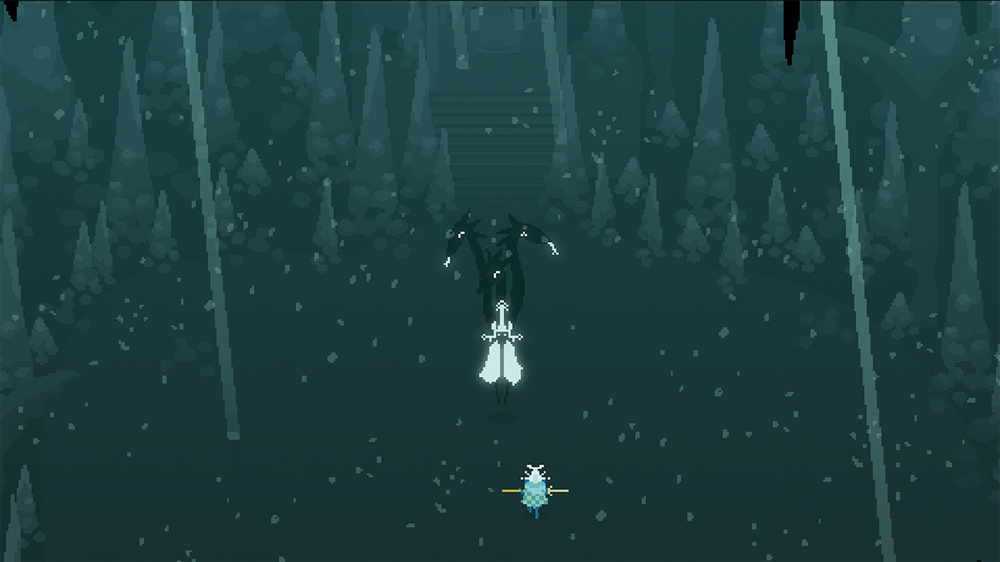
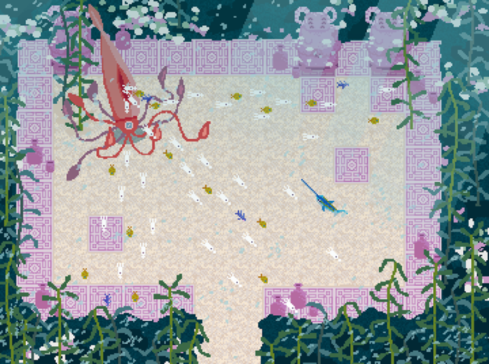

# Seas the Throne

> Dash, skewer, and fight your way to claim the throne of a fallen underwater kingdom.

---

## 🕹 Gameplay Overview

Combining **bullet-hell dodging**, **resource-based attacks**, and **high-risk melee combat**,  
**Seas the Throne** delivers a fast-paced, high-stakes underwater adventure where players fight to seize control after the mysterious disappearance of Triton, ruler of the sea.

You play as a swordfish humanoid hero, battling through waves of hostile sea creatures, mastering dashes, skewering foes, and reclaiming the power of the throne.

---

### ⚔️ Core Mechanics

- **Dash and Spear:**  
  Skewer enemy fish by dashing through them at high velocity. Careful movement is key — a mistimed dash will leave you vulnerable.
  
- **Fling Collected Fish:**  
  Use speared fish as ammunition to launch ranged counterattacks. Manage your limited ammo and choose your moments wisely.

- **Risky Melee Combat:**  
  Brave players can dive into enemy territory for direct melee strikes, dealing greater damage but exposing themselves to more risk.

- **Bullet-Hell Dodging:**  
  Navigate dense, patterned enemy fire while maintaining momentum. Learn enemy attack rhythms to survive and retaliate.

- **Strategic Movement:**  
  Dashing provides a burst of speed but is constrained by cooldowns and limited space, creating intense decision-making moments in tight arenas.

---

### 🌊 World and Story

As players fight to the throne, they'll uncover clues about Triton's disappearance through:
- **Environmental storytelling**
- **Ancient tablets hidden in levels**
- **NPC dialogue before boss battles**

Was Triton murdered, trapped, or did he vanish willingly? Only those who survive the ocean's greatest dangers will find the answer.

---

## 🎯 Key Features

- **Bullet-Hell, Boss-Rush Action:** Face off against towering sea monsters in close-quarters combat arenas.
- **Unique Ammo System:** Skewer enemies to collect limited ammunition, balancing offense and defense.
- **Dash-Based Collection and Evasion:** Master high-velocity movement mechanics and tight timing to survive.
- **Diverse Biomes:** Progress through richly detailed underwater environments with distinct enemies and hazards.
- **Mystery-Driven Storyline:** Piece together the truth about the fall of the underwater kingdom.
- **Multi-Platform Play:** Available on Windows, Mac, and Linux. Playable with keyboard, trackpad, or controller.

---

## 📸 Screenshots

  

  

  

  

  

---

## 👥 Contributors

- **Alexey Elkin** (Lead Developer)  
- Andy Lasson  
- Angela Zhu  
- David Kim  
- Eugene Choi  
- Grace Myers  
- Jeremy Ku-Benjet  
- Alan Liu
